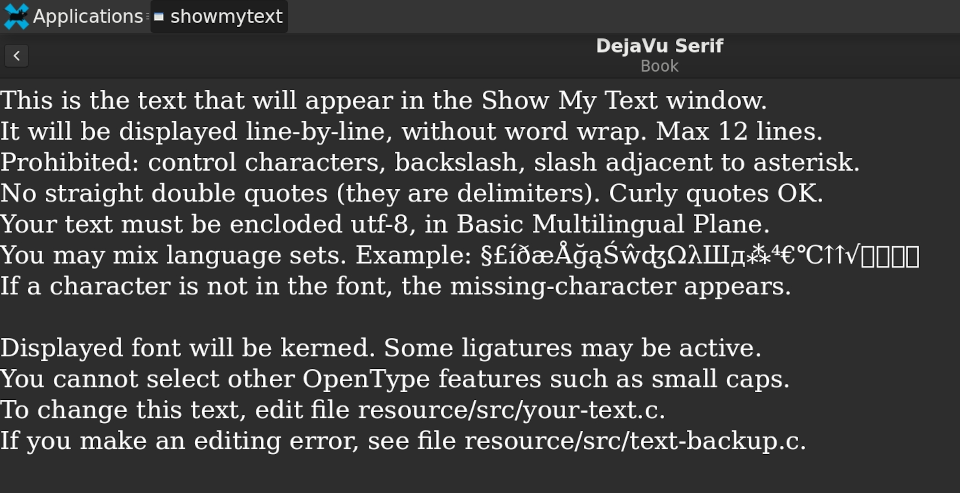

# Show-my-Text
Display a text block of your choice, for Linux and Termux

## DESCRIPTION

Program `showmytext` displays a block of text in a selected font.
You choose the text (UTF-8) prior to building the code.
At runtime, you may select the font, which may be installed or not.

This program may be useful for font developers.
Although there are many ways to display a block of text, `showmytext'
does it quickly, without needing to open a word processor.
In most cases, the characters are kerned, and common ligatures
will be used, depending on the features of the chosen font.

Only European right-to-left languages are supported.
Fonts must be scalable (no bitmap fonts).

The software automatically honors system light-dark theme.
Controls are few, and easily understood.

## PLATFORM:

This software is intended for Linux. It can also be used in Termux,
with a GUI (such as xfce4) enabled. You do not need root or proot.

## USAGE:

When you choose `Show My Text` from your GUI Applications Menu,
it will display a list of installed fonts. Click a font name,
and your sample text will appear.

When you choose `Show My Text` from context menu (right-click) of a font file,
its sample text will appear. The font does not need to be installed.

In either case, the back button (top left of display) brings you to
the list of installed fonts.

The Info button shows font metadata.

## CUSTOMIZATION:

You may change the displayed text. See INSTALL for instructions.

## LICENSE:

Source code has its own Copyrights and credits, written into the files.

Prior to edits, source code obtained from 'GNOME Font Viewer' project v41.0.

All released under GPLv2. See file LICENSE.

## VERSION:

41.0 - Initial upload. Why 41.0? Based on 'GNOME Fonts' v41.0 code.
